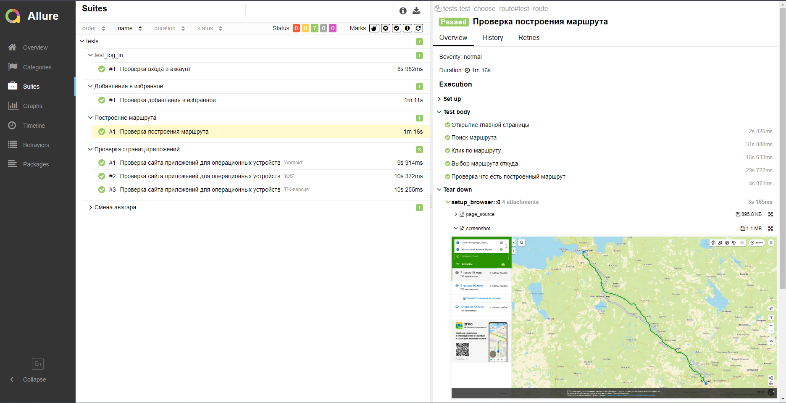
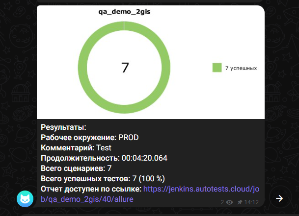

<p align="center">
  <a href="https://2gis.ru">
    <picture>
      
    </picture>
  </a>
</p>
<h1 align="center">
  Demo auto-test 2GIS
</h1>

<p align="center">
2GIS (2 ГИС) – бесплатное программное обеспечение, предназначенное для навигации по городу. В приложении имеется подробное описание для каждой организации, включающее в себя адрес, телефон, детальную информацию и маршрут проезда. Карты некоторых городов выполнены в 3D и имеют условные обозначения для удобного поиска.

## Используемые инструменты в проекте
          

----
### Локальный запуск
> Для локального запуска с дефолтными значениями необходимо выполнить команду:
### 1. Склонировать репозиторий
```
git clone https://github.com/djaldoit/demo_aqa_2gis.git
```
### 2. Запуск
```
python -m venv .venv
source .venv/bin/activate
pip install -r requirements.txt
pytest tests
```

----
### Удаленный запуск автотестов выполняется на сервере Jenkins
> <a target="_blank" href="https://jenkins.autotests.cloud/job/demo_2gis/">Ссылка на проект в Jenkins</a>

#### Параметры сборки
* `build` - Build сборки
* `comment` - комментарий


#### Для запуска автотестов в Jenkins

1. Открыть <a target="_blank" href="https://jenkins.autotests.cloud/job/demo_2gis/">проект</a>
2. Выбрать пункт `Build with Parameters`
3. Указать Build сборки
4. Указать комментарий
5. Нажать кнопку `Build`
6. Результат запуска сборки можно посмотреть в отчёте Allure

----
### Allure отчет


<details><summary>Общие результаты</summary>
  

</details>

<details><summary>Список тест кейсов</summary>
  

</details>

<details><summary>Пример Telegram отчета</summary>
  

</details>

<details><summary>Пример видео отчета о прохождении ui-теста</summary>
  

</details>

